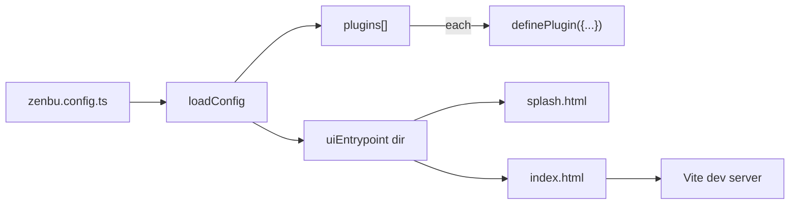

# Zenbu Framework Manual

A reference for working in this monorepo: where things live, how to do common
tasks, what to look at when something breaks. Concrete file paths instead of
prose so it stays accurate as code shifts.

## Repository layout

`packages/`:

| Package | Published as | Purpose |
| --- | --- | --- |
| `core` | `@zenbujs/core` | Framework runtime, CLI (`zen` bin), launcher, loader, build pipeline. Everything the user-facing app touches. |
| `create-zenbu-app` | `create-zenbu-app` | `npm create zenbu-app` scaffolder. Just copies `template/`. |
| `hmr` | `@zenbujs/hmr` | Heavily-modified fork of dynohot. Powers HMR for main-process services. |
| `advice` | `@zenbu/advice` | Renderer-side function wrapping (`replace`, `advise`). Bundled into core's dist. |
| `kyju` | `@zenbu/kyju` | Embedded document DB. Bundled into core's dist. |
| `zenrpc` | `@zenbu/zenrpc` | Typed main↔renderer RPC. Bundled into core's dist. |
| `agent`, `claude-acp`, `codex-acp` | `@zenbu/...` | Agent-protocol bridges. Independent of the core framework. |

Anything not here was deleted in past refactors: `init`, `zen`, `runtime`,
`lint` are gone.

## How a Zenbu app is wired

User-side: a Zenbu app is a directory with `zenbu.config.ts` (the only
config) and a `package.json` that depends on `@zenbujs/core`. Scaffolded by
`pnpm create zenbu-app`.



- `uiEntrypoint` is a **directory**. It must contain `splash.html` (loaded
  raw) and `index.html` (served through Vite).
- `plugins` is a flat list. Each entry is a `definePlugin({...})` inline OR
  a path to a `zenbu.plugin.ts` file with the same shape.
- Plugin shape: `name`, `services` (glob), `schema?`, `migrations?`,
  `preload?`, `events?`, `icons?`. Pure main-process — no per-plugin UI.

API definitions: [`packages/core/src/cli/lib/build-config.ts`](packages/core/src/cli/lib/build-config.ts).
Resolution: [`packages/core/src/cli/lib/load-config.ts`](packages/core/src/cli/lib/load-config.ts).

## The `zen` CLI

Public commands:

| Command | What | Implementation |
| --- | --- | --- |
| `zen dev` | Spawn Electron with setup-gate as main entry | [`commands/dev.ts`](packages/core/src/cli/commands/dev.ts) |
| `zen build:source` | Transform user TS into `.zenbu/build/source/` | [`commands/build-source.ts`](packages/core/src/cli/commands/build-source.ts) |
| `zen build:electron [-- <eb args>]` | Stage launcher + bundled bun/pnpm + invoke electron-builder | [`commands/build-electron.ts`](packages/core/src/cli/commands/build-electron.ts) |
| `zen publish:source [init|push]` | Push staged source to mirror repo | [`commands/publish-source.ts`](packages/core/src/cli/commands/publish-source.ts) |
| `zen link` | Regenerate registry types from `zenbu.config.ts` | [`commands/link.ts`](packages/core/src/cli/commands/link.ts) |

Internal (not in `--help`):

- `zen monorepo <link|unlink>` — symlink helper for framework dev (`commands/monorepo.ts`).
- `zen db generate` — scaffold a kyju migration (`commands/db.ts`).

Dispatcher: [`packages/core/src/cli/bin.ts`](packages/core/src/cli/bin.ts).

## Boot flow (dev mode)

1. `pnpm dev` → `zen dev` → spawn Electron with `--project=<cwd>`.
2. Electron's `package.json#main` resolves to
   `node_modules/@zenbujs/core/dist/setup-gate.mjs`.
3. [`setup-gate.ts`](packages/core/src/setup-gate.ts):
   - Resolves `zenbu.config.ts` via `loadConfig` (`loadConfigPhase`).
   - Spawns the splash window (`splash.html` raw) — happens BEFORE
     advice + dynohot register so a colored window appears within a
     frame of `app.whenReady` instead of waiting for the loader chain.
     The BaseWindow is created `show: true` with its `backgroundColor`
     already set; splash content paints into the WebContentsView a
     frame or two later.
   - Registers the zenbu loader + advice + dynohot
     (`registerLoadersPhase`) — runs with the splash window already on
     screen.
   - Imports `zenbu:plugins?config=<path>` (virtual URL).
4. The zenbu loader ([`loaders/zenbu.ts`](packages/core/src/loaders/zenbu.ts))
   emits a barrel that:
   - Calls `runtime.replacePlugins([...])` and `runtime.registerAppEntrypoint(dir, splash)`.
   - Imports each plugin's service files.
5. Services register automatically — the zenbu loader tail-appends
   `runtime.register(<Class>, import.meta)` to any file the resolved
   config classified as a service, so user code never types `import.meta`
   or imports `runtime`. Detection uses the same regex as `zen link`:
   one `export class <Name>Service extends Service[.withDeps(...)]` per
   file. The append is skipped if the source already contains
   `runtime.register(` (escape hatch for intermediate base classes or
   any case the regex misses). Core's own services in
   `@zenbujs/core/services/*` aren't in the user config glob, so they
   keep an explicit `runtime.register(...)` call. Implementation:
   `appendAutoRegister` in [`loaders/zenbu.ts`](packages/core/src/loaders/zenbu.ts).
   Services then evaluate in dependency order. `BaseWindowService`
   adopts the splash window. `WindowService.openView` swaps the splash
   WebContentsView for the Vite-served renderer when ready.

## Boot flow (production .app)

1. `package.json#main` is `launcher.mjs` ([`packages/core/src/launcher.ts`](packages/core/src/launcher.ts)).
2. Launcher reads `app-config.json` (mirror URL, branch, installing.html
   path if staged).
3. If `app-config.json#installingHtml` is set (the user shipped
   `<uiEntrypoint>/installing.html`), launcher pops a `BaseWindow` +
   `WebContentsView` with that HTML before clone + install. Progress
   events are emitted to the page via the framework's built-in preload —
   see "Installing window" below.
4. First launch: `isomorphic-git.clone` from mirror into
   `~/.zenbu/apps/<name>/`. Subsequent launches: `git fetch` + fast-forward
   if working tree clean.
5. Launcher runs bundled `pnpm install` (binary at
   `Resources/toolchain/pnpm`). Toolchain is provisioned at build time —
   see [`cli/lib/toolchain.ts`](packages/core/src/cli/lib/toolchain.ts).
6. Launcher hands the installing window (if any) off to setup-gate via
   `globalThis.__zenbu_boot_windows__`.
7. Launcher dynamic-imports the apps-dir's
   `node_modules/@zenbujs/core/dist/setup-gate.mjs`. From here the dev
   flow takes over. `spawnSplashWindow` adopts the handed-off window and
   swaps its child WebContentsView from `installing.html` to
   `splash.html` in place — no second-window flash.

## Hot reload

Three independent watchers cover three change types:

- **Edit a service file**: dynohot ([`@zenbujs/hmr`](packages/hmr)) watches
  the file, invalidates that module, re-evaluates. Service runtime
  hot-swaps the class via the `import.meta` accept handler in
  `runtime.register`.
- **Add/remove a service file in a glob dir**: zenbu loader subscribes to
  the directory via `@parcel/watcher`, calls
  `context.hot.invalidate()` on the matching barrel URL when the dir
  contents change. The barrel re-emits with the new file list.
- **Edit `zenbu.config.ts` (or any imported `zenbu.plugin.ts`)**: dynohot
  invalidates the `zenbu:plugins?config=...` URL. The loader runs again
  but can't `await import()` from inside a load hook (deadlocks the
  loader worker), so it shells out to
  [`cli/resolve-config.ts`](packages/core/src/cli/resolve-config.ts) via
  `execFileSync` with `ELECTRON_RUN_AS_NODE=1`. ~100ms per cycle.

The first boot uses the resolved config passed through `register()`'s
`data` channel, sidestepping the subprocess entirely on the hot path.

## Build pipeline (publishing an app)

`pnpm build:source`:

- Reads `build` from `zenbu.config.ts`.
- Globs `include` minus `ignore`, applies `transforms`, writes to
  `.zenbu/build/source/` with a `.sha` containing the source HEAD.

`pnpm publish:source [init|push]`:

- Reads mirror config from `build.mirror`.
- `init`: pushes a fresh seed to the mirror. Refuses if mirror already
  has a `[synced from <sha>]` trailer.
- `push`: appends a new commit with the staged source + the
  `[synced from <sha>]` trailer. No-op if the mirror tip is already
  synced from the same source SHA.
- Implementation: [`cli/lib/mirror-sync.ts`](packages/core/src/cli/lib/mirror-sync.ts).

`pnpm build:electron [-- <electron-builder args>]`:

- Provisions bundled bun + pnpm into a tmpdir staging area
  ([`cli/lib/toolchain.ts`](packages/core/src/cli/lib/toolchain.ts)).
- Stages `launcher.mjs`, generated `package.json`, `app-config.json`.
- Reads the user's `electron-builder.json`. Overlays `directories.app`,
  `files`, `extraResources`, `npmRebuild: false`. Everything else
  (signing, notarize, mac.target, publish) stays user-owned.
- Invokes `electron-builder build --config <merged>`. Pass `-- --publish always`
  to upload to a GitHub release.

Distribution channels (independent):

- **Source mirror**: `pnpm publish:source push` after `pnpm build:source`.
  Existing installs `git pull` updates on next launch.
- **GitHub release**: `pnpm build:electron -- --publish always` after
  bumping `package.json#version`.

## Publishing framework packages to npm

```bash
pnpm --filter @zenbujs/core build       # always rebuild before publishing
cd packages/core
# bump version field in package.json
pnpm publish --no-git-checks --access public --otp=<code>
```

`pnpm publish` correctly rewrites `workspace:*` deps to literal versions.
**Do not use `npm publish`** — npm leaves `workspace:*` as a literal in
the published tarball, breaking installs outside the monorepo.

## Testing changes against a real app

For the framework dev loop you want a real app pointed at your local core
checkout. Use the `ZENBU_LOCAL_CORE` env var (undocumented in `--help` —
purely a dev hook):

```bash
ZENBU_LOCAL_CORE=/Users/robby/.zenbu/plugins/zenbu/packages/core \
  node /Users/robby/.zenbu/plugins/zenbu/packages/create-zenbu-app/dist/index.mjs \
  /tmp/scratch-app
cd /tmp/scratch-app && pnpm install && pnpm dev
```

The scaffolder rewrites `@zenbujs/core` to `link:<env value>` before the
initial git commit. Implementation: [`packages/create-zenbu-app/src/index.ts`](packages/create-zenbu-app/src/index.ts).

For the in-tree sample apps (live edits to framework reflect immediately
after rebuilding core):

- [`/Users/robby/zenbu-make/`](../../zenbu-make/) — kept linked, used for
  the public release pipeline.
- [`/Users/robby/zenbujs-app/`](../../zenbujs-app/) — older, has the
  devtools plugin.

## Logs & debugging

| File | What |
| --- | --- |
| `~/.zenbu/.internal/launcher.log` | Production launcher (clone/fetch, pnpm install, EPIPE-safe stdout from the .app) |
| `~/.zenbu/.internal/setup-gate.log` | Empty file used by setup-gate for stream patches |
| `~/.zenbu/.internal/kernel.log` | Older host-shell logs (pre-refactor) |
| `~/.zenbu/.internal/db.json` | DB registry (recent paths) |

Useful env vars:

- `ZENBU_VERBOSE=1` — verbose logging across setup-gate, loader, db, services.
- `ZENBU_CONFIG_PATH` — set by setup-gate to the absolute `zenbu.config.ts` path. Read by services that need to find the project root.
- `ZENBU_APPS_DIR` — override `~/.zenbu/apps/<name>` for sandboxed launches.
- `ZENBU_REGISTRY_DIR` — override the `zen link` output directory.
- `ZENBU_LOCAL_CORE` — see "Testing".

## Splash window

The splash is a static HTML file at `<uiEntrypoint>/splash.html`, loaded
raw (no Vite) into a `WebContentsView` before any plugin service evaluates.

To eliminate the white-frame flash on launch, declare the splash's
background color via a meta tag in the splash's `<head>`:

```html
<meta name="zenbu-bg" content="#1a1a1a">
```

The framework reads this and uses it as the BaseWindow's `backgroundColor`,
so the OS never composites a frame of the wrong color before the splash's
pixels arrive. Default is `#F4F4F4` when the meta tag is missing.

Implementation: `spawnSplashWindow` + `readSplashBgColor` in
[`packages/core/src/setup-gate.ts`](packages/core/src/setup-gate.ts).

## Installing window

The production launcher ([`packages/core/src/launcher.ts`](packages/core/src/launcher.ts))
shows a window during clone + first install when the user shipped
`<uiEntrypoint>/installing.html`. Optional — apps without it just see a
dock bounce while the launcher works. Dev mode is unaffected
(`pnpm dev` doesn't clone or install).

How it's wired:

- `<uiEntrypoint>/installing.html` is auto-detected by `loadConfig` (see
  `installingPath` in [`load-config.ts`](packages/core/src/cli/lib/load-config.ts)).
  The user does NOT specify a path — convention only.
- `zen build:electron` copies it into the bundle, copies the framework's
  built-in preload from `@zenbujs/core/dist/installing-preload.cjs`, and
  appends both as `extraResources` (next to `toolchain/`). Records the
  paths in `app-config.json#installingHtml` / `installingPreload`.
- Sibling assets (CSS, fonts, images referenced from the HTML) are the
  user's responsibility via their own `electron-builder.json#extraResources`.
  The framework only stages the canonical pair.

Page-side IPC API (exposed by the built-in preload):

```js
const off = window.zenbuInstall.on("step",     (p) => { /* p.id, p.label */ })
window.zenbuInstall.on("message",  (p) => { /* p.text */ })
window.zenbuInstall.on("progress", (p) => { /* p.phase, p.loaded, p.total, p.ratio */ })
window.zenbuInstall.on("done",     (p) => { /* p.id */ })
window.zenbuInstall.on("error",    (p) => { /* p.id, p.message */ })
window.zenbuInstall.off("step", cb)
```

Step ids: `"clone" | "fetch" | "install" | "handoff"`. Progress is
best-effort: clone/fetch use `isomorphic-git`'s `onProgress`; install
parses pnpm's `Progress: resolved X, reused Y, downloaded Z` and a
generic `N/M` fallback. When no progress can be parsed, only `message`
events fire.

Background color: same `<meta name="zenbu-bg" content="#xxx">`
convention as splash. Default `#F4F4F4`.

Implementation: `maybeOpenInstallingWindow` + `spawnInstall`'s
per-line teeing in [`launcher.ts`](packages/core/src/launcher.ts);
preload at [`installing-preload.ts`](packages/core/src/installing-preload.ts).

## Code-signing & notarization (macOS)

- Signing identity in `electron-builder.json#mac.identity`. **Bare
  common-name only** (e.g. `"Robert Pruzan (7YBC6H852Y)"`) — leading
  `Developer ID Application:` is rejected by electron-builder 26.
- Notarization needs `APPLE_ID`, `APPLE_APP_SPECIFIC_PASSWORD`,
  `APPLE_TEAM_ID` env vars when invoking `pnpm build:electron`. Set
  `mac.notarize: true` in `electron-builder.json`.
- Verify staple: `xcrun stapler validate dist/mac-arm64/<app>.app` — the
  validate action worked.

## When things break

Most common failure modes and where to look:

| Symptom | Likely culprit | Look at |
| --- | --- | --- |
| `ERR_PACKAGE_PATH_NOT_EXPORTED ./config` | Outdated published `@zenbujs/core` resolved at install time | The user's `node_modules/@zenbujs/core/package.json#exports` |
| `Unknown module format: undefined` for a `zenbu:` URL | Loader returned malformed result OR loader load not entered | Add tracing in [`loaders/zenbu.ts`](packages/core/src/loaders/zenbu.ts) `loadImpl`; check dynohot's `supportsHotBackingURL` includes `zenbu:` |
| Edits to `zenbu.config.ts` don't pick up new plugins | Subprocess re-resolve broken | Run [`dist/cli/resolve-config.mjs`](packages/core/dist/cli/resolve-config.mjs) standalone with project dir; should print JSON |
| App quits immediately on `pnpm dev` | No service opens a window (host plugin missing `WindowService` dep + `openView`) | [`/Users/robby/zenbu-make/src/main/services/app.ts`](../../zenbu-make/src/main/services/app.ts) is the canonical example |
| Notarized .app installs OK but launcher hangs on other Mac | Mirror not initialized OR mirror is private | Verify `gh release view`, `gh repo view <mirror>`, set repo public |
| `spawnSync ... ETIMEDOUT` from inside the loader | We spawned `process.execPath` (= Electron) without `ELECTRON_RUN_AS_NODE=1` | [`loaders/zenbu.ts`](packages/core/src/loaders/zenbu.ts) `resolveConfigViaSubprocess` |
| `dynohot` lookups fail at runtime in the published .app | core deps missing `@zenbujs/hmr` (forgot to move from devDeps) | [`packages/core/package.json`](packages/core/package.json) — must be in `dependencies` |

## Quick recipes

### "Bump the framework, ship a new release of an app"

```bash
# In the framework
cd ~/.zenbu/plugins/zenbu/packages/core
# bump version, edit code, ...
pnpm --filter @zenbujs/core build
pnpm publish --no-git-checks --access public --otp=<code>

# In the app
cd ~/zenbu-make
node -e 'const fs=require("fs"); const p="package.json"; const j=JSON.parse(fs.readFileSync(p)); j.dependencies["@zenbujs/core"]="^X.Y.Z"; j.version="A.B.C"; fs.writeFileSync(p,JSON.stringify(j,null,2)+"\n")'
pnpm install
git add -A && git commit -m "bump"
pnpm build:source && pnpm publish:source push
pnpm build:electron -- --publish always
```

### "Reset local app state"

```bash
rm -rf ~/.zenbu/apps/<app-name>            # apps-dir clone
rm -rf ~/.zenbu/cache/toolchain            # bundled bun/pnpm cache (re-downloads on next build)
rm -rf <project>/.zenbu                    # per-project staging (build:source out, deps-sig, etc.)
```

### "Test a fresh app from npm (no local link)"

```bash
cd /tmp && rm -rf zfresh && pnpm create zenbu-app zfresh
cd zfresh && pnpm install && pnpm dev
```
