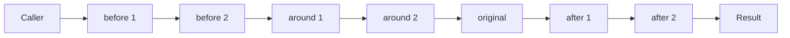

# Ordering and removal

When more than one advice targets the same function, the chain is composed deterministically. Understanding the order matters when you need to coexist with another plugin's advice.

## Per-function chain

Every advised function has a chain that looks roughly like:

```
[before-1, before-2, ...] → [around-1 → around-2 → ... → original] → [after-1, after-2, ...]
```

- `before` handlers run in **registration order**, with no return value (anything returned is ignored).
- `around` handlers run in **registration order**, but each receives a `next` that calls the *next-inner* advice (or the original at the bottom).
- `after` handlers run in **registration order** with the original's return value.
- A `replace` advice short-circuits everything: only the latest registered `replace` runs (any others are dormant).

Visualized:



## Removal

Each call to `advise(...)` or `inject(...)` returns an unregister function. The registration is removed when:

- You explicitly call the unregister fn.
- The `useDisposable` it's wrapped in tears down (service reload or shutdown).
- Your plugin is disabled or uninstalled.

When a registration is removed, the framework:

1. Removes the entry from the in-memory registry.
2. Invalidates the affected view's prelude module.
3. Fires `advice.reload` for the affected scope, causing the view to reload.

## What if two `replace` advices target the same function?

The most recently registered wins. The earlier one is dormant — it will *not* run, but it still exists in the registry, and if the latest registration is removed, the earlier one becomes active again.

In practice: don't rely on this for correctness. If you're adding a `replace`, assume it's the only one. If you need to compose, use `around` instead.

## What if a registration runs *before* its target view is open?

That's the common case — services typically register at boot. The framework keeps the registration in memory; when the view opens, the prelude module reads the registration set and applies it.

## What if a content script throws on load?

The error is logged to the view's console and the script's effect doesn't apply. Other content scripts on the same view still run.

## What if an advice handler throws?

For `before` and `after`: the error is logged; the chain continues with the original function's normal flow.

For `around`: the error propagates up the chain. If the caller doesn't catch, the React tree's nearest error boundary handles it. This is intentional — `around` is the "wrap everything" position, and silent failures there are debugging hell.

For `replace`: same as `around` — propagates up.

## Debugging

```bash
nr zen advice list notes
```

Prints every active advice + content script targeting the `notes` scope, in chain order. Useful when behavior is mysterious and you suspect interference between plugins.

For renderers, the prelude module logs each registration as it applies (visible in the view's devtools console). Filter by `[advice]` or `[content-script]`.
