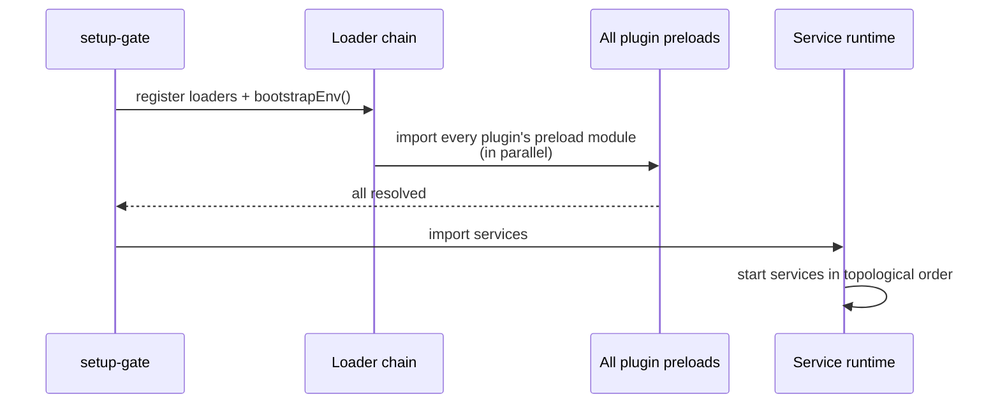

# Preloads API

There is no `@zenbujs/core/preloads` import — the surface is split between:

- A plugin's preload module (a TypeScript file pointed to by `zenbu.plugin.json#preload`).
- The `Preloads` service (server-side).
- `usePreload()` (renderer-side, exported from `@zenbujs/core/react`).

## Defining

A plugin's preload file:

```typescript
// src/main/preload.ts
export default async function preload(): Promise<T> {
  return { /* ... */ }
}
```

Or a static object:

```typescript
export default { /* ... */ }
```

Whatever you return is published as `Preloads["<plugin-name>"]`. Type inference flows automatically through [`zen link`](/api/cli/zen).

The function takes **no arguments**. Process-wide globals (`process.env`, `os`, `path`) are available; nothing else.

## `Preloads` service (server-side)

Imported from `@zenbujs/core/services`:

```typescript
import { Preloads } from "@zenbujs/core/services"

export class MyService extends Service.with({ preloads: Preloads }) {
  // this.ctx.preloads["my-plugin"] — typed
}
```

The service has one shape: a typed proxy keyed by plugin name. Each leaf is the corresponding preload's resolved value.

Calling a missing key (`this.ctx.preloads["unknown-plugin"]`) returns `undefined`.

## `usePreload(selector?)` (renderer-side)

Imported from `@zenbujs/core/react`:

```typescript
import { usePreload } from "@zenbujs/core/react"

function usePreload(): Preloads
function usePreload<T>(selector: (p: Preloads) => T): T
```

Mirrors `useDb`'s API surface but without the optimistic-write semantics — preloads don't change.

## What's *not* public

- The internal `__zenbu_preloads__` global the framework uses to expose preloads to renderers. **Not public.**
- The `CorePreloads` empty interface — augmentation point for the registry, only consumed indirectly via `zen link`. Plugin code should never reach into it.

## Boot ordering



Two guarantees:

1. **All preloads finish before any service starts.** A service can read any preload from `start()` synchronously.
2. **Preloads run in parallel.** A slow preload in plugin A doesn't block plugin B's preload, but every service waits for both.

## Failure mode

Any preload that throws (or whose returned Promise rejects) **halts boot**. The error is logged with the offending plugin's name; the app exits.

Preload failures are not recoverable at runtime by design — they signal that the host environment is in a state the app can't run in.
