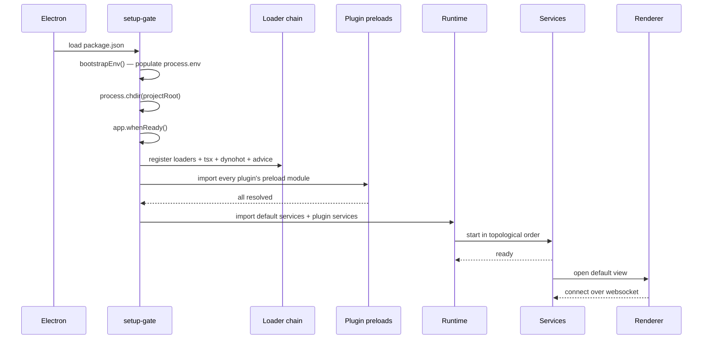

# Boot overview

For 99% of plugin authors, boot Just Works™: `package.json#main` points at a framework entrypoint, you run `nr dev`, and your services start. This page describes what's happening if you ever need to look under the hood.

## The boot sequence

Each phase runs sequentially; the framework guarantees ordering.

## Phase 1: Electron entrypoint

`package.json#main` resolves to one of:

- `node_modules/@zenbujs/core/dist/setup-gate.mjs` — the live-source / dev path. Most projects.
- `node_modules/@zenbujs/core/dist/frozen-gate.mjs` — the frozen-source path. Used when `frozenSource()` adapter is active.

You almost never invoke either yourself. The build adapter (or your scaffold) writes the right `main` field.

## Phase 2: Environment bootstrap

[`bootstrapEnv()`](/api/core/setup-gate#bootstrapenv) reads `~/.zenbu/.internal/paths.json` (created by the framework on first launch) and exports a few env vars:

- `PATH` is augmented with the toolchain dir (so `pnpm`, `bun` are available to subprocesses).
- `ZENBU_INTERNAL_DIR` points at the framework's caches.
- `ZENBU_APPS_DIR` defaults to `~/.zenbu/apps/`.

This runs synchronously and is fast (~1ms).

## Phase 3: Project resolution

In dev (`nr dev`), the project is the directory you ran the command from. In production (live-source mode), the launcher provisions `~/.zenbu/apps/<name>/` and passes it via `--project=`.

The framework `chdir`s into the project root and sets `ZENBU_CONFIG_PATH` to the resolved `config.json`.

## Phase 4: Loader chain registration

The framework registers four Node module loaders, in order:

1. **Zenbu loader** — resolves `zenbu:plugins?config=...` and `zenbu:barrel?manifest=...` virtual modules.
2. **TSX** — TS → JS compilation.
3. **Advice transform** — Babel pass for [function advice](/advice/function-advice) (only used when the renderer is loading; main process services don't go through this).
4. **Dynohot** — wraps every module in a hot-reload proxy.

After this point, every `import "...service..."` in plugin code passes through all four.

## Phase 5: Preloads

The framework imports every plugin's `preload` module in parallel and awaits all of them. See [Preloads overview](/preloads/overview) for what this looks like from a plugin author's perspective.

If any preload throws, **the framework exits**. There's no recovery — preloads represent host-environment invariants.

## Phase 6: Services boot

The framework imports `@zenbujs/core/services/default` (registers built-in services) and the plugin barrel `zenbu:plugins` (registers every plugin's services). The runtime's reconcile loop computes the dep graph and starts services in topological order.

Each service:

1. Constructor runs.
2. `this.ctx` is injected.
3. `start()` is awaited.
4. `useDisposable` calls register their teardowns.

A failure in one service is logged and the runtime continues with the others (dependents wait on `blocked`).

## Phase 7: Default view

If `manifest.uiEntrypoint` is set, the framework auto-opens that view in the main window. Otherwise, the first `Window.openView({...})` call from any service shows the UI.

The renderer connects to the main process over a websocket. From the user's perspective, the window is "ready" when this connection completes — usually a frame after Electron shows the window.

## Total boot time

Reference: a 5-plugin app with one schema migration to apply.

| Phase | Time |
| --- | --- |
| Electron startup | 200-400ms (you don't control this) |
| `bootstrapEnv` | &lt;1ms |
| Loader registration | 5-10ms |
| Preloads (parallel) | 10-50ms (fastest plugin's slowest preload) |
| Service boot | 30-150ms |
| Renderer connect | 50-150ms |

For most apps, the **electron startup** dominates. Optimizing your services rarely moves the needle on time-to-window.

## Customizing boot

For typical apps you don't customize. If you need to — see [Customizing boot](/boot/customizing-boot).

## Where to next

<CardGroup cols={2}>
  <Card title="App config" icon="file" href="/boot/app-config">
    `config.json` schema and resolution rules.
  </Card>
  <Card title="setup-gate" icon="rocket" href="/boot/setup-gate">
    The framework's main-process entrypoint, and what happens inside it.
  </Card>
  <Card title="Customizing boot" icon="screwdriver-wrench" href="/boot/customizing-boot">
    Custom env, custom project root, splash screens.
  </Card>
</CardGroup>
