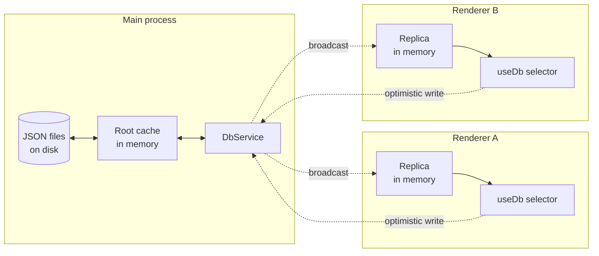

# Database overview

Every Zenbu app gets a built-in database called **Kyju**. It's:

- **Document-shaped.** You declare a schema; the runtime gives you a typed object you mutate. No tables, no joins.
- **Replicated.** The main process is the source of truth. Each renderer holds an in-memory replica that updates optimistically.
- **Sync to read, async to write.** Reads are local and instant in every process. Writes go through the main process and broadcast.
- **Auto-migrated.** You change the schema; the framework generates a migration file and applies it on the next boot.
- **JSON on disk.** The database is a directory of JSON files (one per section, plus a `.lock` and a per-collection page directory). Easy to inspect, easy to back up, easy to commit if you want to version state alongside code.

If you've used MobX, Recoil, or [Replicache](https://replicache.dev) in front of an HTTP API — Kyju is the same idea, but the "server" is your local main process.

## Mental model



A click in renderer A updates A's replica immediately, sends the write across the websocket, the main process applies it, and the broadcast lands in B's replica almost in the same frame. If the write is rejected (validation failure, version conflict), A's replica rolls back.

## Sections

The database is partitioned into **sections** by plugin. Each plugin contributes one section, named after the plugin (`zenbu.plugin.json#name`):

```
root
└── plugin
    ├── counter-app          # this plugin's section
    │   └── count: 7
    └── notes-plugin         # another plugin's section
        ├── notes: <collection>
        └── selectedId: "n_1"
└── core                     # the framework's own section
    ├── lastKnownViewRegistry: [...]
    └── windowPrefs: {...}
```

Two implications:

- Two plugins **cannot collide** even if they use the same field names.
- Plugins can read each other's sections (after declaring a peer-dep) but cannot directly *write* outside their own section. Cross-plugin writes go through RPC.

## Field types

Kyju's `f` (for "field") is a typed proxy over [zod](https://zod.dev). Anything you can do with zod, you can do with `f`:

```typescript
import { defineSchema, f, z } from "@zenbujs/core/db"

export const schema = defineSchema({
  count: f.number().default(0),
  notes: f.array(z.string()).default([]),
  user: f.object({ name: z.string(), age: z.number() }),

  // Kyju-specific extensions:
  thumbnail: f.blob({ debugName: "thumbnail" }),
  log: f.collection(z.object({ id: z.string(), at: z.number(), msg: z.string() })),
})
```

`f.blob()` and `f.collection()` are the two extensions Kyju adds on top of zod. They're explained in their own pages:

- [Blobs](/db/blobs) — opaque binary data with chunked transfer.
- [Collections](/db/collections) — paginated arrays for datasets too large to keep in the root cache.

`f` re-exports every zod constructor and decorates each one with a `.default(value)` method. The `.default()` value is what's inserted on first migration.

`z` is also re-exported for the (occasional) cases where you want raw zod (e.g. inside `z.object({...})`).

## Reading

On the main process, in any service that depends on `DbService`:

```typescript
const root = this.ctx.db.read()
const count = root.plugin["counter-app"].count
```

`db.read()` is a synchronous snapshot. The returned object is structurally typed against your schema (and any other registered plugins' schemas).

On the renderer, anywhere inside a `<ZenbuProvider>`:

```typescript
import { useDb } from "@zenbujs/core/react"

const count = useDb(root => root.plugin["counter-app"].count)
```

`useDb(selector)` subscribes to the section the selector touches. Re-renders only happen when the selected slice changes.

## Writing

```typescript
await this.ctx.db.update(root => {
  root.plugin["counter-app"].count += 1
})
```

`db.update(fn)` runs your function against a draft of the root, then applies the diff. The whole thing is a transaction: if the function throws, nothing is committed.

The renderer can call `db.update` indirectly via RPC (preferred) — see [Using on the client](/db/using-on-client). It cannot mutate the replica directly.

## Migrations

Schema changes are tracked as ordered migration files in `db/migrations/<plugin-name>/<n>_<description>.ts`. The CLI generates them for you:

```bash
nr zen db generate --name add_user_email
```

It diffs your current schema against the most-recent migration's resulting shape and writes a TypeScript file with the operations needed to make the on-disk data match. See [Migrations](/db/migrations).

## Where to next

<CardGroup cols={2}>
  <Card title="Defining a schema" icon="diagram-project" href="/db/defining-a-schema">
    Field types, defaults, nested objects, and the `f` proxy.
  </Card>
  <Card title="Using on the server" icon="server" href="/db/using-on-server">
    `db.read()`, `db.update()`, and the lifecycle of a write.
  </Card>
  <Card title="Using on the client" icon="browser" href="/db/using-on-client">
    `useDb`, `useCollection`, and the optimistic-replica model.
  </Card>
  <Card title="API reference" icon="book-open" href="/api/core/db">
    The strict public surface of `@zenbujs/core/db` — Effect-free.
  </Card>
</CardGroup>
