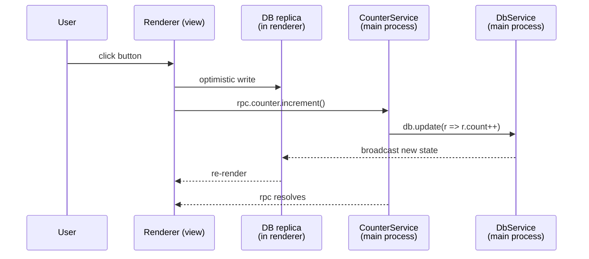

# Mental model

Almost every concept in Zenbu boils down to four nouns. Read these once and the rest of the docs make a lot more sense.

## 1. Plugin

A **plugin** is a directory with a [`zenbu.plugin.json` manifest](/api/manifest/zenbu-plugin-json). It's the unit of distribution and the unit of composition.

```
my-plugin/
├── zenbu.plugin.json     # the manifest
├── package.json
├── tsconfig.json
├── src/
│   ├── main/             # services (run on the main process)
│   ├── renderer/         # UI source (rendered in views)
│   └── content/          # advice + content scripts (injected into views)
```

The manifest declares:

- which **services** the plugin contributes (a glob of TS files),
- the plugin's **database schema** (one file, optional),
- the plugin's **event topics** (one file, optional),
- the plugin's **preload module** (one file, optional),
- a **setup script** for one-time host-machine setup (optional),
- icons + display metadata for any **views** the plugin registers.

**Your application is a plugin.** It uses the same manifest, the same APIs, the same lifecycle. There is no privileged "host" type. A user can drop another plugin in alongside yours and the two compose without coupling.

A running Zenbu app is a list of plugins read from [`config.json`](/api/manifest/config-json). At boot time the framework imports each plugin's services and starts them up; on disable, services tear down cleanly without restarting the app.

## 2. Service

A **service** is a long-lived dependency-injected object that owns a piece of state or a piece of behavior. Roughly: anything that would be a `class` with a `constructor()` and a `dispose()` in another framework is a service in Zenbu.

```typescript
import { Service, runtime } from "@zenbujs/core/runtime"
import { DbService } from "@zenbujs/core/services"

export class CounterService extends Service.with({ db: DbService }) {
  static key = "counter"

  async increment() {
    await this.ctx.db.update(r => { r.plugin.counter.count += 1 })
  }

  async start() {
    // initialize, register listeners, kick off background work...
  }
}

runtime.register(CounterService, import.meta)
```

A few invariants worth internalizing:

- **Services have unique string keys.** Two plugins can't both register `static key = "counter"`.
- **Services declare their dependencies.** `Service.with({ db: DbService })` says "I need a `DbService` running before I start." The framework computes the dependency graph and starts services in the right order.
- **`this.ctx.<name>` is auto-typed.** If you wrote `db: DbService`, then `this.ctx.db` is a `DbService` — no `declare ctx: { db: DbService }` boilerplate needed.
- **Services hot-reload.** When you save a service file, the runtime tears down the old instance (running its cleanups) and spins up the new one. Dependents reload too if their dep's API changed.
- **Public methods are RPC-callable from the renderer.** Any `async` method whose name doesn't start with `_` is automatically reachable from the renderer as `rpc.<service-key>.<method-name>(...)`.

That's the whole programming model on the main process: define services, declare their deps, write methods. Dependency injection, RPC, and HMR are byproducts.

## 3. Process

Zenbu apps are, like all Electron apps, multi-process — but the framework abstracts this very deliberately.

- **The main process** runs every Service. Services own all of the state, do all of the I/O, and are the source of truth.
- **Renderer processes** run [views](/views/overview). Each view is rendered into a `WebContentsView` (Electron's iframe replacement). A view is just a Vite-built React app.
- **Each view holds an in-memory replica** of the database. Writes go through the main process; reads are local. This means `useDb()` in a renderer is *always* synchronous and never round-trips.
- **Cross-process communication** happens over a single websocket per renderer. RPC, DB sync, and events all multiplex over the same socket. You never write IPC code yourself.

The framework's invariant: **renderer code is never authoritative.** If your service decides not to apply a write, the renderer's optimistic update gets rolled back. If your service emits an event, every renderer subscriber gets it. If your service crashes, the renderers see disconnected state and reconnect when it comes back.

## 4. Runtime

The **runtime** is the singleton that owns every Service in the process. There is exactly one runtime per Electron process, and it's accessed as the named export `runtime`:

```typescript
import { runtime } from "@zenbujs/core/runtime"

runtime.register(CounterService, import.meta)   // declare a service
runtime.get(CounterService)                     // look it up
await runtime.shutdown()                        // clean shutdown
```

In practice you only ever call `runtime.register(...)`. The other operations are mostly internal — but they are documented and stable.

## How a request flows

Here's the lifecycle of a single button click. This is the canonical example you should keep in your head.



A few things worth noting:

- The view re-renders **before** RPC resolves, because the replica applied the optimistic update locally.
- If the service rejects the write, the replica rolls back automatically.
- Other views subscribed to the same DB section see the update as soon as the broadcast arrives — no extra fetching.

## Mental model checklist

If you can answer these four questions without flipping back, you're ready for the rest of the docs:

1. What's the difference between a plugin and a service?
2. Where does state live?
3. How does a renderer call a main-process method?
4. What does HMR mean in Zenbu, and which kinds of code participate?

(Answers: a plugin contains services; state lives in the main-process database with renderer replicas; renderers call typed RPC over a websocket; HMR covers main services, schemas, renderer code, and content scripts — basically everything except framework internals.)
