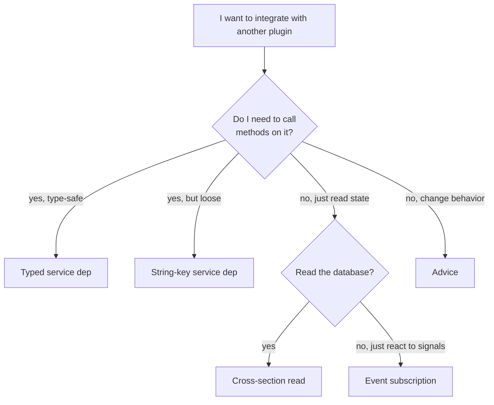

# Inter-plugin dependencies

Two plugins can talk to each other through five mechanisms, ordered from tightest to loosest coupling:

1. **Typed service-to-service deps.** `Service.with({ x: OtherService })`.
2. **String-key service deps.** `Service.with({ x: "other-service" })`.
3. **Cross-section database reads.** `root.plugin["other-plugin"].x`.
4. **Event subscriptions.** `events["other-plugin"].something.subscribe(cb)`.
5. **Advice / content scripts.** Inject behavior into the other plugin's runtime.

Each tightens or loosens the type-system coupling differently. Pick the loosest one that gets the job done.

## Typed deps (tightest)

When you import another plugin's service class, you get full TypeScript checking:

```typescript
// In your plugin's package.json:
{
  "peerDependencies": {
    "@example/agents-plugin": "*"
  }
}
```

```typescript
import { AgentManagerService } from "@example/agents-plugin/services/agents"

export class MyService extends Service.with({ agents: AgentManagerService }) {
  static key = "my-service"

  async start() {
    const list = await this.ctx.agents.list()    // typed
  }
}
```

Pros: complete type-safety, static analysis, refactoring tools work.

Cons: a hard build-time dependency. If `@example/agents-plugin` isn't installed, your plugin's TS doesn't compile.

Use this when both plugins are part of the same repo, or when you control both and you want the type checker to enforce coupling.

## String-key deps (medium)

Reference the service by its string key:

```typescript
export class MyService extends Service.with({
  agents: "agents",                              // required
  optionalAgents: optional("agents"),            // optional
}) {
  static key = "my-service"

  async start() {
    this.ctx.agents.list?.()                     // unknown — you have to type-assert or null-check
  }
}
```

Pros: no build-time dep. Your plugin compiles standalone; the runtime will block your service if the dep isn't running.

Cons: untyped. You're essentially calling into `unknown` and trusting the contract by hand.

Use this for **debug/inspection plugins** that introspect any service, or for **integration plugins** where you'd rather degrade gracefully than fail at install.

## Cross-section reads (loose, type-safe via registry)

```typescript
const settings = this.ctx.db.read().plugin["settings-plugin"].theme
```

This works anywhere — service or renderer. The type comes from the [registry](/rpc/typed-registry); if `settings-plugin` is in the user's installed set, you get autocomplete. If it's not, the field is missing and TypeScript flags it.

Pros: read-only, low-friction, declarative, fully composable.

Cons: read-only. If you need to *change* the other plugin's data, this isn't the right mechanism.

## Event subscriptions (loose)

```typescript
this.useDisposable("audit", () =>
  this.ctx.events["other-plugin"].something.subscribe(payload => {
    // ...
  }),
)
```

Pros: no class import; type-safe through the registry.

Cons: events are fire-and-forget. If you missed it, you missed it.

Use this for **audit/log/analytics plugins** that observe other plugins, and **integration plugins** that react to specific signals.

## Advice / content scripts (loosest)

Wrap, replace, or inject code into another plugin without coupling at all. See [Advice](/advice/overview).

Pros: zero coupling at the type level. The other plugin doesn't need to expose anything.

Cons: brittle. You're targeting *implementation* (a specific function name in a specific module), not API. If the other plugin refactors, your advice breaks silently.

Use this only when you can't get the same effect via the higher-level mechanisms.

## Choosing the right one



## A worked example

Suppose you're writing an **audit plugin** that logs every note added in any note-taking plugin.

You don't need typed deps (you might want to support multiple notes plugins).
You don't need DB reads (the data already exists; you just want to react to it).
You need event subscriptions:

```typescript
import { Service, runtime } from "@zenbujs/core/runtime"
import { Events } from "@zenbujs/core/services"

export class AuditService extends Service.with({ events: Events }) {
  static key = "audit"

  async start() {
    const knownNotePlugins = ["notes-plugin", "markdown-notes", "drafts"]
    for (const plugin of knownNotePlugins) {
      const sub = (this.ctx.events as any)[plugin]?.noteAdded?.subscribe?.(payload => {
        console.log(`[${plugin}] note added:`, payload.id)
      })
      if (sub) this.useDisposable(`audit-${plugin}`, () => sub)
    }
  }
}

runtime.register(AuditService, import.meta)
```

You got the audit hook without coupling to any one notes plugin's source.
