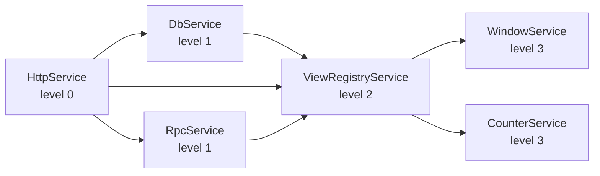

# Dependencies

Services declare their dependencies via the map passed to [`Service.with({...})`](/api/core/runtime#servicewith). The runtime uses this to compute startup order, drive hot reload, and inject `this.ctx`.

## Required dependencies

The default form: pass a service class. The runtime guarantees it's started before yours, and `this.ctx.<name>` is typed to the instance.

```typescript
import { Service, runtime } from "@zenbujs/core/runtime"
import { DbService, HttpService } from "@zenbujs/core/services"

export class MyService extends Service.with({
  db: DbService,
  http: HttpService,
}) {
  static key = "my-service"

  async start() {
    this.ctx.db                 // DbService
    this.ctx.http               // HttpService
  }
}
```

If a required dep can't start (its source crashes, or its own deps aren't ready), your service waits in the `blocked` state. As soon as the dep recovers, your service starts.

## Optional dependencies

When you want a dep if it exists, but don't want to block on it:

```typescript
import { Service, optional } from "@zenbujs/core/runtime"

export class MyService extends Service.with({
  agents: optional(AgentManagerService),
}) {
  static key = "my-service"

  async start() {
    if (this.ctx.agents) {
      // The plugin contributing AgentManagerService is installed.
      this.ctx.agents.list()
    }
  }
}
```

`this.ctx.agents` is typed as `AgentManagerService | undefined`. The runtime starts your service whether or not the optional dep is present.

If an optional dep **becomes available later** (someone installed a plugin while the app is running), your service is reloaded automatically so `this.ctx.agents` becomes defined. If it goes away, your service is reloaded again with `this.ctx.agents` undefined.

## String-key dependencies

Sometimes you want to depend on a service from another plugin without importing its class — e.g. for cross-plugin coupling that you don't want to harden into a type dependency, or to avoid pulling another plugin into your bundle:

```typescript
export class MyService extends Service.with({
  agents: "agents",                          // required, untyped
  optionalAgents: optional("agents"),        // optional, untyped
}) {
  static key = "my-service"

  async start() {
    this.ctx.agents.list?.()                 // typed as `unknown`
  }
}
```

The trade-off: you give up `this.ctx.agents` being typed. Use this sparingly — typed class refs are almost always better. The string form exists primarily for tools and debug services that don't want to hard-import every plugin.

## Cross-plugin deps

If your plugin depends on another plugin's service:

```typescript
// In your plugin's package.json:
{
  "peerDependencies": {
    "@example/agents-plugin": "*"
  }
}
```

```typescript
// In your service:
import { AgentManagerService } from "@example/agents-plugin/services/agents"

export class MyService extends Service.with({ agents: AgentManagerService }) {
  // ...
}
```

This works because all plugins share the same `ServiceRuntime` and the same loaded class identities — there is no "plugin A's service vs plugin B's service" type drift, even if both plugins ship a copy of `@zenbujs/core` (the loader chain dedupes them).

If the user hasn't installed the agents plugin, your plugin's `start()` is blocked. Use `optional()` if you want to handle that gracefully.

## How startup order is computed

The runtime builds a directed dependency graph from your `static deps` declarations and computes a topological sort. Within a level, services start **in parallel**; across levels, the runtime waits for one level to finish before starting the next.



If a cycle exists, the runtime throws at registration time with the cycle members in the error message. Cycles between services are almost always a sign of a missing third-party dep that should hold the shared state.

## Reload propagation

When a service hot-reloads (its source file changed), the runtime tears down the dependent subgraph in reverse-topological order, then re-evaluates them in forward-topological order. So if you save `db.ts`:

1. `WindowService`, `CounterService` (level 3) tear down,
2. `ViewRegistryService` (level 2) tears down,
3. `DbService`, `RpcService` (level 1) tear down,
4. The new `DbService` evaluates,
5. `RpcService`, `ViewRegistryService`, `WindowService`, `CounterService` evaluate.

This is why teardown should be cheap and idempotent — it can run thousands of times during a normal day of development.

## What `this.ctx` is

`this.ctx` is a plain object the runtime injects right before `start()`. The keys are exactly the keys of your `static deps`; the values are the instances. Two implementation details worth knowing:

- The injection happens **between construction and `start()`**. That means you can read `this.ctx` from inside `start()` and from any method called after `start()`. Reading it from `constructor()` is undefined behavior — don't.
- The `ctx` for an **optional missing dep** is `undefined`, not a stub. Always null-check.

## Anti-pattern: dynamic deps

You may be tempted to do:

```typescript
async someMethod() {
  const agents = runtime.get(AgentManagerService) // 🚫
}
```

Don't. The runtime has no way to know your service depends on `AgentManagerService` if you reach into the singleton at call time. That means:

- The agents service might not be started.
- A reload of agents won't reload your service.
- It's invisible to anyone reading `static deps`.

Always declare deps statically. Use `optional()` if you might not have it.
