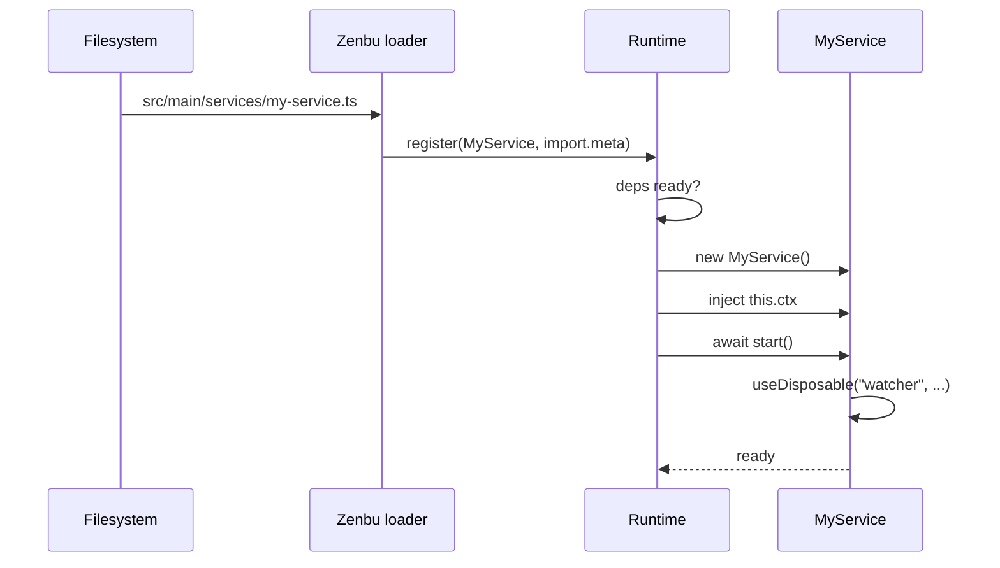
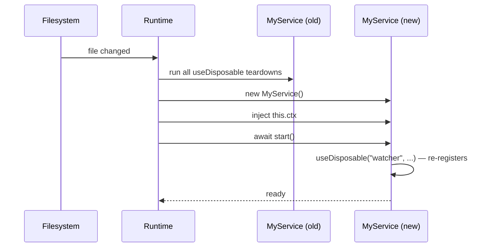

# Lifecycle

A service goes through four phases:

1. **Registered.** The runtime has the class but hasn't instantiated it yet (deps not ready).
2. **Evaluating.** The runtime is calling `start()`. If it throws, the service moves to `failed`.
3. **Ready.** `start()` returned. Methods are callable; RPC is exposed; renderers can subscribe.
4. **Tearing down.** The runtime is running registered disposables, in registration order.

The runtime moves a service through these phases for three reasons: **boot**, **hot reload**, and **shutdown**. Code that is correct in one needs to be correct in all three.

## Boot



## Hot reload

When you save a file that's part of a service's module graph, the loader chain (Vite for renderers, dynohot for the main process) invalidates that file's module. The runtime sees `runtime.register(MyService, import.meta)` re-execute with the same `static key`, and:



The whole cycle should take **single-digit milliseconds** for a leaf service. If yours doesn't, look at whether `start()` is doing too much eagerly — push slow work into the first method that needs it.

### What gets reloaded with a service?

When a service file (or any file it transitively imports) changes, the runtime reloads:

1. The service itself,
2. Every service that has it as a `deps:` (transitive — full dependent subtree),
3. Anything that called `useDisposable("...", fn)` inside that service.

What does **not** reload:

- Renderer code (that's Vite's job, see [views](/views/overview)),
- Database schemas (those go through migrations, see [db migrations](/db/migrations)),
- The loader chain itself (changing the framework requires a process restart).

### How to write reload-safe code

Three principles:

1. **All resources go through `useDisposable`.** Anything you `addEventListener`, `setInterval`, `subscribe`, `spawn` — wrap it. The runtime tears down disposables on reload; bare side-effects leak.
2. **`start()` is idempotent.** It's called once per evaluation, but evaluations happen on every save. Don't accumulate state outside the instance — use instance fields.
3. **Methods don't capture the instance.** Specifically, don't pass `this.someMethod` to a long-lived callback registered outside `useDisposable` — after a reload, that bound method points at the dead instance. If you need cross-reload identity, use a stable global registry keyed by service key.

Example of getting it right:

```typescript
async start() {
  this.useDisposable("clock", () => {
    const id = setInterval(() => this.tick(), 1000)
    return () => clearInterval(id)        // teardown rebinds correctly
  })
}

private tick() {
  // safe — runs against the current instance
}
```

Example of getting it wrong:

```typescript
async start() {
  setInterval(this.tick.bind(this), 1000) // 🚫 leak: never cleaned up
}
```

## Shutdown

When the user quits the app:

1. Electron fires `before-quit`.
2. The runtime stops accepting new RPCs.
3. Services tear down in **reverse topological order** — dependents first, deps last.
4. Each service runs every `useDisposable` teardown it ever registered.
5. The DB flushes pending writes and releases its lock file.
6. Electron exits.

If a teardown throws, the runtime logs and keeps going. Shutdown should be best-effort — never block.

### Deliberate shutdown vs reload

Disposable teardowns receive a single argument: a `CleanupReason` of `"reload"` or `"shutdown"`. If your teardown only needs to do a thing on real shutdown:

```typescript
this.useDisposable("flush", () => {
  return reason => {
    if (reason === "shutdown") {
      this.flushToDisk()
    }
  }
})
```

In practice, reason matters only for things like flushing a large cache that's expensive to rebuild on reload — for most services, the same teardown is correct in both cases.

## Failed services

If `start()` throws, the service is `failed`:

- The error is logged with the service key.
- Any service that has this one as a dep waits in `blocked`.
- The renderer's connection still works for unrelated services.
- A subsequent file save (with a fix) moves the service back through `evaluating → ready` and wakes its dependents.

You can introspect failure state via `runtime.get(...)` or via the [`runtime` service](/runtime/runtime-control), which exposes status to the renderer.

## What about `optional` deps becoming available?

When an optional dep that was missing becomes available (or vice versa), the runtime treats it like a reload of the dependent service:

1. Tear down the dependent (and its dependents),
2. Re-inject `ctx` with the new `optional` value,
3. Re-evaluate.

This means: an `optional()` dep that you read inside `start()` re-runs `start()` whenever that dep flips. Code accordingly.
