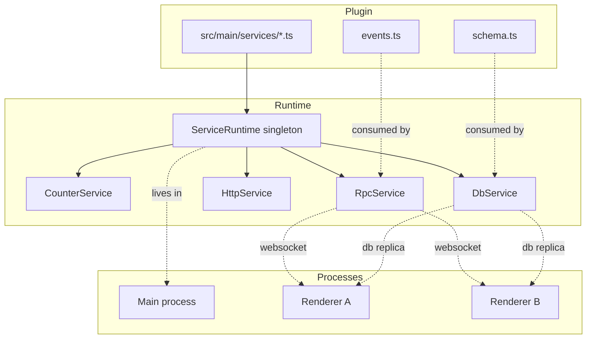

# Runtime overview

Every Zenbu process — the main process, and any subprocess that opts in — has exactly one **runtime**. The runtime owns:

1. The set of registered service classes,
2. Each service's current instance (or null if it failed / its deps aren't ready),
3. The dependency graph between them,
4. Hot-reload bookkeeping for every service,
5. Lifecycle for the entire system: boot, reload, shutdown.

You almost never call the runtime directly. The most common interaction is one line at the bottom of a service file:

```typescript
runtime.register(MyService, import.meta)
```

Everything else (resolution order, hot reload, teardown) is implicit.

## What "service" means here

A **service** is a class that:

- has a unique `static key`,
- declares its dependencies on other services,
- exposes some methods (synchronous, async, or RPC-callable) that other services and renderers use,
- optionally registers side-effects (open a server, subscribe to a watcher, etc.) and pairs each one with a teardown.

The runtime guarantees:

- Services start in **dependency-graph order**: a service's `start()` runs only after every required dep is ready.
- Services stop in **reverse** order: dependents tear down before their deps do.
- A failure in one service doesn't take down the others — it goes into a `failed` state and its dependents wait.
- A change to a service's source code reloads only that service and its dependents.

## How the runtime fits into the rest of the system



## Built-in services

Zenbu ships a handful of services with `@zenbujs/core` and registers them automatically when your app boots. You depend on them by name; you never instantiate them yourself.

| Service | Key | What it does |
| --- | --- | --- |
| [`DbService`](/db/overview) | `db` | Owns the database, exposes `client`, broadcasts changes to renderers. |
| [`RpcService`](/rpc/overview) | `rpc` | Builds the RPC router from registered services and exposes `emit` for events. |
| `HttpService` | `http` | Local websocket + HTTP server that renderers connect to. |
| [`Events`](/rpc/events) | `events` | Typed event-emit proxy auto-namespaced per plugin. |
| [`ViewRegistryService`](/views/overview) | `view-registry` | Tracks every plugin-registered view + its dev server. |
| `WindowService` | `window` | Opens views into Electron `WebContentsView`s, owns dialogs/clipboard. |
| `BaseWindowService` | `base-window` | Owns the underlying Electron `BaseWindow`s. |
| `ReloaderService` | `reloader` | Manages the Vite dev server attached to each view. |
| `RendererHostService` | `renderer-host` | Maps the application's renderer entrypoint into the registry. |
| `RuntimeControlService` | `runtime` | Reload/relaunch RPC for the UI to call. |
| `InstallerService` | `installer` | Runs plugin `setup.ts` scripts, manages the plugin registry. |
| `LocalFileProtocolService` | `local-file-protocol` | Serves user files into the renderer over the `local://` protocol. |
| `FileScannerService` | `file-scanner` | Generic recursive directory scan helpers exposed over RPC. |
| `DebugService` | `debug` | RPC + DB introspection helpers used by the devtools view. |

The full list with method signatures lives in the [services API reference](/api/core/runtime#built-in-services).

## Where to next

<CardGroup cols={2}>
  <Card title="Defining a service" icon="plus" href="/runtime/defining-a-service">
    Walkthrough of writing a custom service.
  </Card>
  <Card title="Dependencies" icon="link" href="/runtime/dependencies">
    Required vs optional, dynamic re-resolution, cross-plugin deps.
  </Card>
  <Card title="Lifecycle" icon="recycle" href="/runtime/lifecycle">
    `start()`, `setup()`, cleanup, hot-reload phases.
  </Card>
  <Card title="API reference" icon="book-open" href="/api/core/runtime">
    The strict public surface of `@zenbujs/core/runtime`.
  </Card>
</CardGroup>
