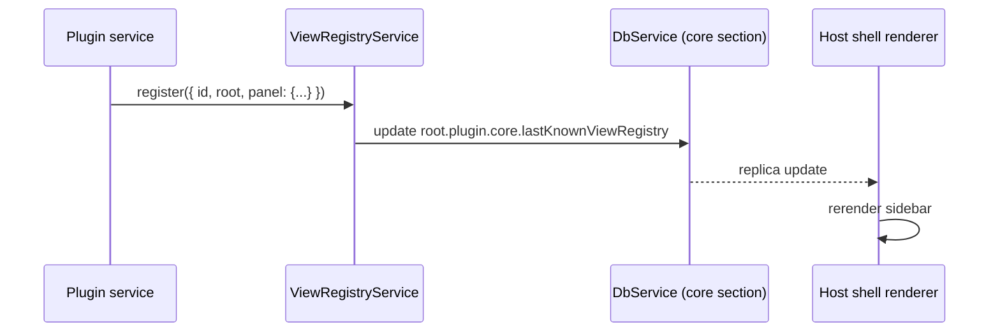

# Panel options

When you register a view, you can pass display metadata under `panel`:

```typescript
this.ctx.views.register({
  id: "notes",
  root: "/abs/path/to/src/renderer",
  panel: {
    sidebar: true,       // include in the left sidebar
    bottomPanel: false,  // include in the bottom panel
    label: "Notes",      // human-readable label
    kind: "primary",     // optional — kind hint for the host shell
  },
})
```

The framework records this in the database section `core.lastKnownViewRegistry`. The host shell reads it and renders accordingly.

## Fields

### `sidebar: boolean`

If true, the view shows up in the host shell's left sidebar. Most "primary" views set this.

### `bottomPanel: boolean`

If true, the view shows up in the host shell's bottom panel (terminals, logs, debug). Mutually exclusive with `sidebar` for a given view (in practice — you can set both, but the host shell picks one based on context).

### `label: string`

Human-readable label used wherever the host renders the view's name. If omitted, the host shows `id` directly.

### `kind: "primary" | "secondary" | "modal"` (planned)

Hint for the host shell about how the view should be presented. Currently a free-form string; the host accepts but doesn't necessarily honor it. Will become a typed enum in a future minor.

## Icons

Icons are declared in the **manifest**, not in `panel`:

```json
{
  "name": "notes-plugin",
  "icons": {
    "notes": "<svg viewBox='0 0 24 24'>...</svg>"
  }
}
```

The key is the view's scope (`id`). The host shell reads these per-manifest at boot and renders them next to the label.

## Where does the metadata flow?



A renderer that wants to query the registry can:

```tsx
import { useDb } from "@zenbujs/core/react"

const views = useDb(root => root.plugin.core.lastKnownViewRegistry)
```

This is what the host shell does internally; no special API.

## What if I want a view that's *not* in the sidebar / bottom panel?

Set `panel: { sidebar: false, bottomPanel: false }` (or omit the panel altogether). The view is still registered and openable via `window.openView({ scope })` — it just doesn't show up in the host shell's chrome. Useful for:

- Modal-style views opened from a menu action,
- Hidden devtools panels gated behind a key chord,
- Views that are launched programmatically by another plugin.
